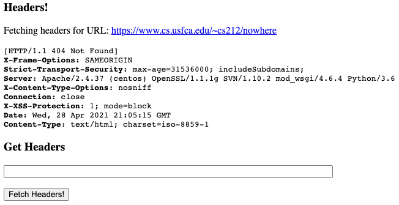
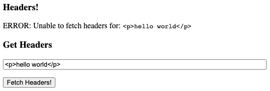

HeaderServer
=================================================

For this homework, you will create a simple Jetty web server that allows users enter a URL and view the HTTP headers for that URL.

**This is an optional makeup homework assignment.** It may be used to make up for points missed on earlier homework assignments, however, it is not possible to earn over 100% in the homework category.

## Functionality ##

Specifically, you must do the following for this assignment:

  1. **`HeaderServer.main():`** Start a Jetty web server on port 8080 and map `/headers` to the `HeaderServlet` servlet.

  1. **`HeaderServer.getHttpHeaders(URL):`** Use the `HttpsFetcher` methods to send a `HEAD` request for the provided URL and return the HTTP headers (no content). **Do NOT send a GET request to the web server!**

  1. **`HeaderServer.HeaderServlet.doGet()`** This servlet should display a simple web form configured to use the `GET` HTTP method that allows users to enter a link and press a button to display the HTTP headers for that link.

      If the appropriate link parameter is present in the `GET` request, the servlet should fetch and **safely** display the HTTP headers for the provided link. The servlet should reasonably protect against malicious content contained within those headers.

      If the servlet is unable to fetch the headers for any reason, display a warning message on the web page. **Do NOT override the `doPost` method for this assignment!**

## Examples ##

The following is one example implementation of this assignment. When a valid link is provided, the resulting web page might look as follows:

When an invalid link is provided, the resulting web page might look as follows:

A `<pre>` tag is used to display the header text in the above examples, but you can decide to format the headers using a table as well.

## Requirements ##

See the Javadoc and `TODO` comments in the template code in the `src/main/java` directory for additional details.

There are no tests for this homework assignment. To earn credit, you must demonstrate the functionality to the instructor or teacher assistant in lab or office hours before the end of the semester.

**This homework must be fully implemented; no credit will be given for partial, incomplete, or incorrect functionality.**

This assignment is worth up to 100 points, but the amount awarded will be capped by the number of points missed in the homework category. For example:

  - If you missed 120 points in the homework category, this assignment can be used to make up 100 of those points.

  - If you missed 60 points in this category, you can only earn up to 60 points for this assignment.

If you already have a 100% in the homework category, you will not be able to earn any credit for this assignment. You may still want to complete the assignment, however. (It is good practice for the final project.)
